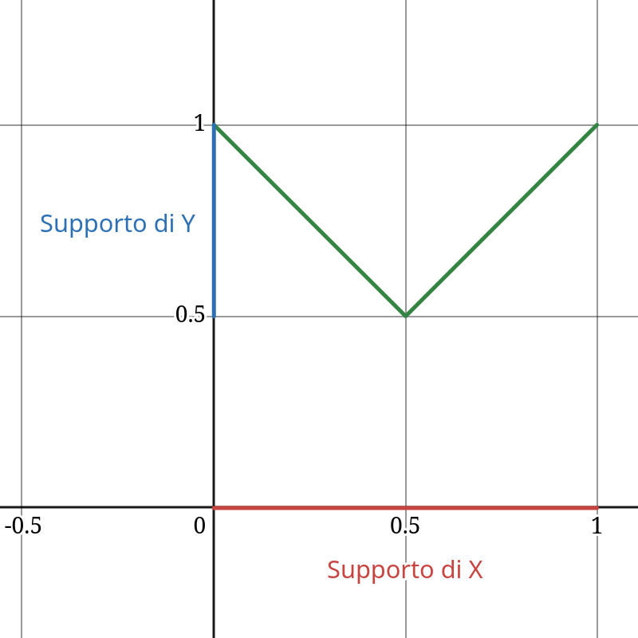

## $$ \textcolor{red}{\text{Esercizi Ex. 17 - Lez. 14}} $$

#### Esercizio 1

Sia $X$ una v.a. uniforme sull’intervallo $(-\pi/6, +\pi/6)$. Sia $Y = \tan(X)$. Trova la funzione di ripartizione e la densità di probabilità di $Y$ usando un metodo diretto.

##### Risoluzione

1. **Calcoliamo la densità di probabilità di $Y$.**

    Notiamo che la tangente è una funzione *strettamente crescente* nell'intervallo $(-\pi/6, \pi/6)$, quindi possiamo applicare il teorema di trasformazione per variabili aleatorie continue.

    $\;$

    Fissiamo $g(x) = \tan(x)$ e calcoliamo la funzione inversa:

    $$
    g^{-1}(y) = \arctan(y)
    $$

    > Se $Y = g(X)$ e $g$ è monotona crescente o decrescente, allora la densità di probabilità di $Y$ è:
    >
    > $$
    > f_Y(y) = f_X(g^{-1}(y))\cdot\left|\frac{d}{dy}g^{-1}(y)\right|
    > $$

    Nel nostro caso:

    $$\begin{aligned}
    f_Y(y)
    &= f_X(\arctan(y))\cdot\left|\frac{d}{dy}\arctan(y)\right| \\
    &= \frac1{\frac{\pi}6 - \left(-\frac{\pi}6\right)}\cdot\left|\frac1{1+y^2}\right| \\
    &= \frac1{\frac{\pi}3}\cdot\frac1{1+y^2} \\
    &= \frac3{\pi(1+y^2)}
    \end{aligned}$$

    

    Determiniamo ora il supporto di $Y$ a partire dal supporto di $X$.

    $$
    -\frac{\pi}6 \le X \le \frac{\pi}6 \\[4pt]
    -\frac{\pi}6 \le \arctan(Y) \le \frac{\pi}6 \\[4pt]
    \tan\left(-\frac{\pi}6\right) \le Y \le \tan\left(\frac{\pi}6\right) \\[4pt]
    -\frac1{\sqrt3} \le Y \le \frac1{\sqrt3}
    $$

    Quindi:

    $$
    \boxed{
    f_Y(y)=
    \begin{cases}
    \frac3{\pi(1+y^2)} & -\frac1{\sqrt3}\le y\le\frac1{\sqrt3} \\
    0 & \text{altrimenti}
    \end{cases}
    }
    \;.
    $$

2. **Calcoliamo la funzione di ripartizione di $Y$.**

    Utilizziamo la definizione di funzione di ripartizione e il fatto che la tangente è crescente.

    $$\begin{aligned}
    F_Y(y)
    &= P(Y\le y) \\
    &= P(\tan(X)\le y) \\
    &= P(X\le \arctan(y)) \\
    &= F_X(\arctan(y))
    \end{aligned}$$

    Per i valori di $y$ appartenenti al supporto:

    $$\begin{aligned}
    F_Y(y)
    &= \int_{-\frac{\pi}6}^{\arctan(y)} f_X(x)\,dx \\
    &= \int_{-\frac{\pi}6}^{\arctan(y)}
    \frac1{\frac{\pi}6-\left(-\frac{\pi}6\right)}
    \,dx \\
    &= \frac3{\pi}
    \int_{-\frac{\pi}6}^{\arctan(y)}
    dx \\
    &= \frac3{\pi}
    \left[x\right]_{-\frac{\pi}6}^{\arctan(y)} \\
    &= \frac3{\pi}
    \left(
    \arctan(y)+\frac{\pi}6
    \right)
    \end{aligned}$$

    Quindi:

    $$
    \boxed{
    F_Y(y)=
    \begin{cases}
    0 & y<-\frac1{\sqrt3} \\
    \frac3{\pi}\left(\arctan(y)+\frac{\pi}6\right)
    & -\frac1{\sqrt3}\le y\le\frac1{\sqrt3} \\
    1 & y>\frac1{\sqrt3}
    \end{cases}
    }
    \;.
    $$

---

#### Esercizio 2

Sia $X$ una v.a. normale con media $0$ e varianza $5$. Sia $Y = |X|$. Trova:

- (a) la densità di probabilità di $Y$
- (b) la media di $Y$

##### Risoluzione

1. **Calcoliamo la densità di probabilità di $Y$.**

    Notiamo che il modulo non è una funzione monotona su tutto il dominio. Per questo motivo non possiamo applicare direttamente il teorema di trasformazione delle variabili aleatorie tramite la funzione inversa.

    $\;$

    Calcoliamo quindi la funzione di ripartizione di $Y$ in funzione di quella di $X$.

    $$\begin{aligned}
    F_Y(y)
    &= P(Y \le y) \\
    &= P(|X| \le y) \\
    &= P(-y \le X \le y) \\
    &= P(X \le y) - P(X < -y) \\
    &= F_X(y) - F_X(-y)
    \end{aligned}$$

    Derivando otteniamo la densità:

    $$\begin{aligned}
    f_Y(y)
    &= \frac{d}{dy}\left \{F_Y(y) \right\} \\
    &= \frac{d}{dy}\left\{F_X(y)-F_X(-y)\right\} \\
    &= f_X(y)-(-f_X(-y)) \\
    &= f_X(y)+f_X(-y)
    \end{aligned}$$

    Dato che $X$ è distribuita come una Normale di media $\mu=0$ ed è quindi centrata in $0$, la densità è una funzione pari:

    $$
    f_X(y)=f_X(-y)
    $$

    

    Pertanto:

    $$\begin{aligned}
    f_Y(y)
    &= f_X(y)+f_X(-y) \\
    &= 2f_X(y) \\
    &= 2\frac1{\sqrt{2\pi5}}e^{-\frac{(y - 0)^2}{2\cdot5}} \\
    &= \frac2{\sqrt{10\pi}}e^{-\frac{y^2}{10}}
    \end{aligned}$$

    Determiniamo il supporto di $Y$. Poiché: $Y = |X|$ il modulo può assumere soltanto valori non negativi:

    $$
    0 \le Y < +\infty
    $$

    Quindi:

    $$
    \boxed{
    f_Y(y)=
    \begin{cases}
    \frac2{\sqrt{10\pi}}e^{-\frac{y^2}{10}} & y\ge0 \\
    0 & \text{altrimenti}
    \end{cases}
    }
    \;.
    $$

2. **Calcoliamo l'aspettazione di $Y$.**

    Utilizziamo la definizione di valore atteso:

    $$\begin{aligned}
    E[Y]
    &= \int_{-\infty}^{+\infty} y\,f_Y(y)\,dy \\
    &= \int_0^{+\infty}
    y\,\frac2{\sqrt{10\pi}}e^{-\frac{y^2}{10}}
    \,dy \\
    &= -5\frac2{\sqrt{10\pi}}
    \int_0^{+\infty}
    \left(-\frac{y}{5}e^{-\frac{y^2}{10}}\right)
    dy \\
    &= -\frac{10}{\sqrt{10\pi}}
    \left[
    e^{-\frac{y^2}{10}}
    \right]_0^{+\infty} \\
    &= -\frac{10}{\sqrt{10\pi}}
    (0-1) \\
    &= \frac{10}{\sqrt{10\pi}} \\
    &= \sqrt{\frac{10}{\pi}}
    \end{aligned}$$

    Pertanto:

    $$
    \boxed{
    E[Y]=\sqrt{\frac{10}{\pi}}
    }
    \;.
    $$

---

#### Esercizio 3

Sia $X$ una v.a. esponenziale con parametro $1/5$. Sia $Y = \sqrt X$. Trova la densità di probabilità di $Y$.

##### Risoluzione

La radice quadrata è una funzione strettamente crescente nel supporto della variabile esponenziale, cioè per $x \ge 0$. Possiamo quindi applicare il teorema di trasformazione delle variabili aleatorie.

Per prima cosa invertiamo la funzione: $g(x)=\sqrt{x}$.

$$\begin{aligned}
y &= \sqrt{x} \\
y^2 &= x
\end{aligned}$$

quindi:

$$
g^{-1}(y)=y^2
$$

Per il teorema di trasformazione:

$$\begin{aligned}
f_Y(y)
&= f_X(g^{-1}(y))
\left|
\frac{d}{dy}g^{-1}(y)
\right| \\
&= f_X(y^2)
\left|
\frac{d}{dy}(y^2)
\right| \\
&= \frac15 e^{-\frac15 y^2}
\left|2y\right| \\
&= \frac25 y e^{-\frac15 y^2}
\end{aligned}$$

Determiniamo il supporto di $Y$.

$$
X \ge 0
\quad\Rightarrow\quad
Y^2 \ge 0
\quad\Rightarrow\quad
Y \ge 0
$$

Quindi:

$$
\boxed{
f_Y(y)=
\begin{cases}
\frac25 y e^{-\frac15 y^2} & y\ge0 \\
0 & \text{altrimenti}
\end{cases}
}
\;.
$$

---

#### Esercizio 4

Sia $X$ l’angolo di inclinazione di un fucile, e sia $A = \frac{v^2}{g}$, dove $v$ è la velocità del proiettile e $g$ l’accelerazione di gravità. Se $X$ è uniformemente distribuito in $(\pi/6, \pi/4)$, trova la densità di probabilità della gittata $Y = A\sin(2X)$.

##### Risoluzione

Notiamo che la funzione seno è strettamente crescente nell'intervallo $[0,\pi/2]$. Poiché il supporto $(\pi/6, \pi/4)$ di $X$ è contenuto in quell'intervallo, segue che $A\sin(2X)$ è strettamente crescente.

Possiamo quindi applicare il teorema di trasformazione delle variabili aleatorie.

Come prima cosa invertiamo la funzione: $g(x)=A\sin(2x)$.

$$\begin{aligned}
y &= A\sin(2x) \\
\frac{y}{A} &= \sin(2x) \\
\arcsin\left(\frac{y}{A}\right) &= 2x \\
\frac12\arcsin\left(\frac{y}{A}\right) &= x = g^{-1}(y)
\end{aligned}$$

Per il teorema di trasformazione:

$$\begin{aligned}
f_Y(y)
&=
f_X(g^{-1}(y))
\left|
\frac{d}{dy}g^{-1}(y)
\right| \\
&=
f_X\left(
\frac12\arcsin\left(\frac{y}{A}\right)
\right)
\left|
\frac{d}{dy}
\left(
\frac12\arcsin\left(\frac{y}{A}\right)
\right)
\right| \\
&=
\frac1{\frac{\pi}{4}-\frac{\pi}{6}}
\left|
\frac1{2A}
\frac1{\sqrt{1-\left(\frac{y}{A}\right)^2}}
\right| \\
&=
\frac{12}{\pi}
\cdot
\frac1{2A}
\cdot
\frac1{\sqrt{1-\left(\frac{y}{A}\right)^2}} \\
&=
\frac6{\pi A}
\left(
1-\frac{y^2}{A^2}
\right)^{-\frac12}
\end{aligned}$$

Determiniamo il supporto di $Y$.

$$
\frac{\pi}6 < X < \frac{\pi}4 \\[4pt]
\frac{\pi}6 < \frac12\arcsin\left(\frac{Y}A\right) < \frac{\pi}4 \\[4pt]
\frac{\pi}3 < \arcsin\left(\frac{Y}A\right) < \frac{\pi}2 \\[4pt]
\sin\left(\frac{\pi}3\right) < \frac{Y}A < \sin\left(\frac{\pi}2\right) \\[4pt]
A\sin\left(\frac{\pi}3\right) < Y < A\sin\left(\frac{\pi}2\right) \\[4pt]
\frac{\sqrt3}{2}A < Y < A
$$

Quindi:

$$
\boxed{
f_Y(y)=
\begin{cases}
\frac6{\pi A}
\left(
1-\frac{y^2}{A^2}
\right)^{-\frac12}
&
\frac{\sqrt3}{2}A<y<A
\\[4mm]
0
&
\text{altrimenti}
\end{cases}
}
\;.
$$

---

#### Esercizio 5

Sia $X$ uniforme in $[0, 1]$. Trova:

- (a) la funzione di ripartizione della v.a. $Y = \max(X, 1 − X)$
- (b) la funzione densità di $Y$

##### Risoluzione

1. **Calcoliamo la funzione di ripartizione di $Y$.**

    Disegniamo la funzione:

    $$
    g(x)=\max(x,1-x)
    $$

    $\;$

    

    $\;$

    Notiamo che non si tratta di una funzione monotona su tutto il dominio, quindi non possiamo applicare direttamente il teorema di trasformazione.

    

    
    Calcoliamo $F_Y$ in termini di $F_X$.

    $$\begin{aligned}
    F_Y(y)
    &= P(Y \le y) \\
    &= P(\max(X,1-X)\le y) \\
    &= P(1-y \le X \le y) \\
    &= P(X\le y)-P(X<1-y) \\
    &= \int_0^{y} f_X(x)\,dx - \int_0^{1-y} f_X(x)\,dx \\
    &= 1\int_0^{y} \,dx - 1\int_0^{1-y} \,dx \\
    &= \left[x\right]_0^{y} - \left[x\right]_0^{1-y} \\
    &= y - (1-y) \\
    &= 2y-1
    \end{aligned}$$

    Determiniamo il supporto di $Y$. Dal disegno:

    $$
    \frac12 \le Y \le 1
    $$

    Quindi:

    $$
    \boxed{
    F_Y(y)=
    \begin{cases}
    0 & y < \frac12 \\
    2y-1 & \frac12 \le y \le 1 \\
    1 & y > 1
    \end{cases}
    }
    \;.
    $$

2. **Calcoliamo la densità di probabilità di $Y$.**

    Deriviamo la funzione di ripartizione appena ottenuta.

    $$\begin{aligned}
    f_Y(y)
    &= \frac{d}{dy}\left\{F_Y(y)\right\} \\
    &= \frac{d}{dy}\left\{2y-1\right\}
    = 2
    \end{aligned}$$

    Quindi:

    $$
    \boxed{
    f_Y(y)=
    \begin{cases}
    2 & \frac12 \le y \le 1 \\
    0 & \text{altrimenti}
    \end{cases}
    }
    \;.
    $$

