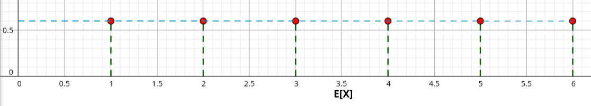
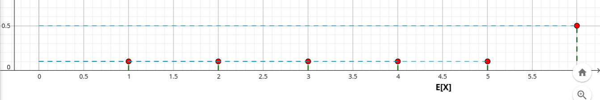

## $$ \textcolor{red}{\text{Esercizi Lez. 11 - Teoria}} $$

#### Esercizio 1

Calcolare l'aspettazione del risultato del lancio di un dado nei seguenti casi:

1. Il dado è equiprobabile.

| $x$ | 1 | 2 | 3 | 4 | 5 | 6 |
|---|---|---|---|---|---|---|
| $p_X(x)$ | $\frac16$ | $\frac16$ | $\frac16$ | $\frac16$ | $\frac16$ | $\frac16$ |

2. Il dado non è equiprobabile e la funzione di probabilità è:

| $x$ | 1 | 2 | 3 | 4 | 5 | 6 |
|---|---|---|---|---|---|---|
| $p_X(x)$ | $\frac1{10}$ | $\frac1{10}$ | $\frac1{10}$ | $\frac1{10}$ | $\frac1{10}$ | $\frac12$ |

##### Risoluzione

> Ricordiamo la formula dell'aspettazione per una variabile aleatoria discreta:
>
> $$ E[X] = \sum_{x\in S_X} x\cdot p_X(x) $$

1. **Dado equiprobabile**

    $$\begin{aligned}
    E[X]
    &= 1\cdot\frac16 + 2\cdot\frac16 + 3\cdot\frac16 + 4\cdot\frac16 + 5\cdot\frac16 + 6\cdot\frac16 \\
    &= \frac{1+2+3+4+5+6}{6} \\
    &= \frac{21}{6} = \boxed{3.5} \;.
    \end{aligned}$$

    

2. **Dado non equiprobabile**

    $$\begin{aligned}
    E[X]
    &= 1\cdot\frac1{10} + 2\cdot\frac1{10} + 3\cdot\frac1{10} + 4\cdot\frac1{10} + 5\cdot\frac1{10} + 6\cdot\frac12 \\
    &= \frac{1+2+3+4+5}{10} + 3 \\
    &= \frac{15}{10} + 3 = \boxed{4.5} \;.
    \end{aligned}$$

    

---

#### Esercizio 2

Sia $X$ una variabile aleatoria con funzione di probabilità

| $x$ | -1 | 0 | 1 |
|---|---|---|---|
| $p_X(x)$ | $\frac15$ | $\frac25$ | $\frac25$ |

e sia $Y=X^2$. Calcolare $E[X]$ ed $E[Y]$.

##### Risoluzione

1. **Calcolo di $E[X]$**

    $$\begin{aligned}
    E[X]
    &= \sum_{x\in S_X} x\cdot p_X(x) \\
    &= (-1)\cdot\frac15 + 0\cdot\frac25 + 1\cdot\frac25 \\
    &= -\frac15 + \frac25 = \boxed{\frac15} \;.
    \end{aligned}$$

2. **Determinazione della distribuzione di $Y=X^2$**

    Il supporto di $Y$ è:

    $$
    S_Y=\{0,1\}
    $$

    e la funzione di probabilità è:

    $$\begin{aligned}
    p_Y(0)
    &= P(Y=0)
    = P(X^2=0)
    = P(X=0)
    = \frac25 \;. \\
    p_Y(1)
    &= P(Y=1)
    = P(X^2=1)
    = P(X\in\{-1,1\}) \\
    &= P(X=-1)+P(X=1)
    = \frac15+\frac25
    = \frac35 \;.
    \end{aligned}$$

    | $y$ | 0 | 1 |
    |---|---|---|
    | $p_Y(y)$ | $\frac25$ | $\frac35$ |

3. **Calcolo di $E[Y]$**

    $$\begin{aligned}
    E[Y]
    &= \sum_{y\in S_Y} y\cdot p_Y(y)
    = 0\cdot\frac25 + 1\cdot\frac35 = \boxed{\frac35} \;.
    \end{aligned}$$

**Soluzione** $$ \boxed{E[X] = \frac15, \qquad E[Y] = \frac35} $$

---

#### Esercizio 3

Sia $X \sim Ber(p)$. Calcolare $E[2^X]$.

##### Risoluzione

La distribuzione di Bernoulli è:

| $x$ | 0 | 1 |
|---|---|---|
| $p_X(x)$ | $1-p$ | $p$ |

Calcoliamo l'aspettazione della funzione $g(x)=2^x$:

$$\begin{aligned}
E[2^X]
&= \sum_{x\in S_X} 2^x\cdot p_X(x) \\
&= 2^0(1-p) + 2^1p \\
&= 1-p+2p \\
&= \boxed{1+p} \;.
\end{aligned}$$

---

#### Esercizio 4

Sia $X$ una v.a. a valori in $\{-2,-1,1,3\}$ con probabilità rispettivamente $\frac14$, $\frac18$, $\frac14$, $\frac38$. Calcolare $E[X^2]$.

##### Risoluzione

Calcoliamo l'aspettazione della funzione $g(x)=x^2$:

$$\begin{aligned}
E[X^2]
&= \sum_{x\in S_X} x^2\cdot p_X(x) \\
&= (-2)^2\cdot\frac14 + (-1)^2\cdot\frac18 + 1^2\cdot\frac14 + 3^2\cdot\frac38 \\
&= 4\cdot\frac14 + 1\cdot\frac18 + 1\cdot\frac14 + 9\cdot\frac38 \\
&= \frac{38}8 = \boxed{\frac{19}4 = 4.75} \;.
\end{aligned}$$

---

#### Esercizio 5

Sia $X \sim U(a,b)$. Calcolare $E[X^2]$.

##### Risoluzione

> Per una variabile aleatoria continua:
>
> $$ E[g(X)] = \int_{-\infty}^{+\infty} g(x)\,f(x)\,dx $$

Ricordiamo che la densità della uniforme continua è:

$$
f(x)=
\begin{cases}
\dfrac1{b-a} & a\le x\le b \\
0 & \text{altrimenti}
\end{cases}
$$

Nel nostro caso $g(x)=x^2$, quindi:

$$\begin{aligned}
E[X^2]
&= \int_a^b x^2\cdot\frac1{b-a}\,dx
= \frac1{b-a}\int_a^b x^2\,dx \\
&= \frac1{b-a}\left[\frac{x^3}{3}\right]_a^b
= \frac1{b-a}\left(\frac{b^3}{3}-\frac{a^3}{3}\right) \\
&= \boxed{\frac{b^3-a^3}{3(b-a)}} \;.
\end{aligned}$$

---

#### Esercizio 6

Quesiti:
1. L’aspettazione $E[X]$ è il valore più probabile di $X$?
2. L’aspettazione $E[X]$ è sempre positiva?
3. Sia $X$ una variabile aleatoria qualsiasi e siano $E[X]$ e $\mathrm{med}(X)$ rispettivamente la sua aspettazione e la sua mediana. Quale delle seguenti affermazioni è vera?
    - A. $E[X]\ge \mathrm{med}(X)$
    - B. $E[X]\le \mathrm{med}(X)$
    - C. $E[X]=\mathrm{med}(X)$
    - D. Nessuna delle precedenti

##### Risoluzione

1. **No**. L’aspettazione non coincide necessariamente con il valore più probabile. Essa rappresenta il valore medio della variabile aleatoria nel lungo periodo.

2. **No**. L’aspettazione può essere negativa, nulla oppure positiva, a seconda dei valori assunti dalla variabile aleatoria e delle rispettive probabilità.

3. **Risposta D**. In generale non esiste una relazione fissa tra aspettazione e mediana. A seconda della distribuzione può valere:
   
   $$
   E[X]>\mathrm{med}(X),\qquad
   E[X]<\mathrm{med}(X),\qquad
   E[X]=\mathrm{med}(X)
   $$

---

#### Esercizio 7

Sia $M$ il massimo nel lancio di una coppia di dadi. Calcolare $E[M]$.

##### Risoluzione

Il supporto della variabile aleatoria $M$ è:

$$
S_M=\{1,2,3,4,5,6\}
$$

Lo spazio campionario contiene $36$ esiti equiprobabili. La distribuzione di $M$ è:

| $m$ | 1 | 2 | 3 | 4 | 5 | 6 |
|---|---|---|---|---|---|---|
| $p_M(m)$ | $\frac1{36}$ | $\frac3{36}$ | $\frac5{36}$ | $\frac7{36}$ | $\frac9{36}$ | $\frac{11}{36}$ |

Infatti:

$$
P(M=m)=\frac{m^2-(m-1)^2}{36}=\frac{2m-1}{36}
$$

Calcoliamo ora l’aspettazione:

$$\begin{aligned}
E[M]
&= \sum_{m\in S_M} m\cdot p_M(m) \\
&= 1\cdot\frac1{36}
+2\cdot\frac3{36}
+3\cdot\frac5{36}
+4\cdot\frac7{36}
+5\cdot\frac9{36}
+6\cdot\frac{11}{36} \\
&= \frac{161}{36}
\approx \boxed{4.4722} \;.
\end{aligned}$$

---

#### Esercizio 8

Sia $X \sim U(a,b)$. Calcolare $E[X]$.

##### Risoluzione

> Per una variabile aleatoria continua:
>
> $$ E[X]=\int_{-\infty}^{+\infty} x f(x)\,dx $$

La densità della uniforme continua è:

$$
f(x)=
\begin{cases}
\dfrac1{b-a} & a\le x\le b \\
0 & \text{altrimenti}
\end{cases}
$$

quindi:

$$\begin{aligned}
E[X]
&= \int_a^b x\cdot \frac1{b-a}\,dx
= \frac1{b-a}\int_a^b x\,dx \\
&= \frac1{b-a}\left[\frac{x^2}{2}\right]_a^b
= \frac1{b-a}\left(\frac{b^2-a^2}{2}\right) \\
&= \boxed{\frac{a+b}{2}} \;.
\end{aligned}$$

---

#### Esercizio 9

Sia $X$ una variabile aleatoria continua con densità

$$
f(x)=
\begin{cases}
\frac{x}{2} & 0\le x\le2 \\
0 & \text{altrimenti}
\end{cases}
$$

Calcolare $E[X]$.

##### Risoluzione

Verifichiamo prima che sia una densità:

$$
\int_0^2 \frac{x}{2}\,dx = \left[\frac{x^2}{4}\right]_0^2 = 1
$$

Quindi è valida.

Calcoliamo ora l’aspettazione:

$$\begin{aligned}
E[X]
&= \int_{-\infty}^{+\infty} x f(x)\,dx
= \int_0^2 x\cdot \frac{x}{2}\,dx \\
&= \int_0^2 \frac{x^2}{2}\,dx
= \left[\frac{x^3}{6}\right]_0^2 \\
&= \frac{8}{6}
= \boxed{\frac{4}{3}} \approx 1.33 \;.
\end{aligned}$$

---

#### Esercizio 10

Sia $X$ una variabile aleatoria assolutamente continua con funzione di ripartizione

$$
F(x)=
\begin{cases}
0 & x<0 \\
x(2-x) & 0\le x\le1 \\
1 & x>1
\end{cases}
$$

Calcolare $E[X]$.

##### Risoluzione

Deriviamo la funzione di ripartizione per ottenere la densità:

$$
f(x)=F'(x)=
\begin{cases}
2-2x & 0\le x\le1 \\
0 & \text{altrimenti}
\end{cases}
$$

Calcoliamo ora l’aspettazione:

$$\begin{aligned}
E[X]
&= \int_{-\infty}^{+\infty} x f(x)\,dx
= \int_0^1 x(2-2x)\,dx \\
&= \int_0^1 (2x-2x^2)\,dx
= \left[x^2-\frac{2}{3}x^3\right]_0^1 \\
&= 1-\frac{2}{3}
= \boxed{\frac{1}{3}} \;.
\end{aligned}$$

---

> **Nota $-$ Passaggio da $F(x)$ a $f(x)$**  
>
> - **Caso discreto**: la funzione di ripartizione è a “salti”. La probabilità nel punto si ottiene come incremento:
>
>   $$ p(x_k)=F(x_k)-F(x_k^-) $$
>
>   cioè si “rimuove” il valore cumulato precedente e si prende solo l’aumento in quel punto.
>
> - **Caso continuo (a tratti)**: la funzione di ripartizione è continua e derivabile a tratti. La densità si ottiene derivando **ogni intervallo separatamente**:
>
>   $$ f(x)=F'(x) \qquad \text{(per ogni intervallo)} $$
>
>   senza sottrarre o confrontare la derivata con l’intervallo precedente.
>
> In breve:
> - discreto $\to$ differenza tra valori di \(F\) (salti)
> - continuo $\to$ derivata pezzo per pezzo

---