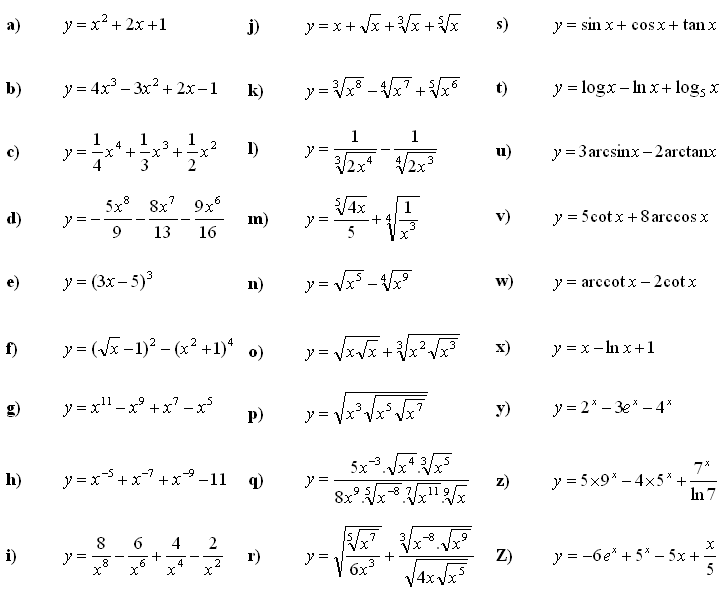

## $$ \textcolor{red}{\text{Ripasso derivate}} $$

> Fonte esercizi:
> https://www.math-exercises.com/limits-derivatives-integrals/derivative-of-a-function

#### Prima Tabella

#### Risoluzioni

1. $$\boxed{
\begin{aligned}
f(x) &= x^2 + 2x + 1 \\[4pt]
\textit{Sol.}\quad
f'(x) &= 2x + 2
\end{aligned}
}$$

2. $$\boxed{
\begin{aligned}
f(x) &= 4x^3 - 3x^2 + 2x -1
\\[4pt]\textit{Sol.}\quad
f'(x) &= 12x^2 -6x +2
\end{aligned}
}$$

3. $$\boxed{
\begin{aligned}
f(x) &= \frac14x^4 + \frac13x^3 + \frac12x^2
\\[4pt]\textit{Sol.}\quad
f'(x) &= x^3 + x^2 + x
\end{aligned}
}$$

4. $$\boxed{
\begin{aligned}
f(x) &= -\frac59x^8 -\frac8{13}x^7 - \frac9{16}x^6
\\[4pt]\textit{Sol.}\quad
f'(x)
&= -\frac{40}9x^7 - \frac{56}{13}x^6 - \frac{54}{16}x^5
\end{aligned}
}$$

5. $$\boxed{
\begin{aligned}
f(x) &= (3x-5)^5
\\[4pt]\text{Sol.}\quad
f'(x)
&= 5(3x-5)^4 \cdot 3 \\
&= 15(3x-5)^4
\end{aligned}
}$$

6. $$\boxed{
\begin{aligned}
f(x) &= (\sqrt x-1)^2-(x^2+1)^4
\\[4pt]\text{Sol.}\quad
f'(x) &= 2(\sqrt x-1)\cdot\frac1{2\sqrt x} - 4(x^2+1)^3\cdot2x \\
&= \frac{\sqrt x-1}{\sqrt x} - 8x(x^2+1)^3
\end{aligned}
}$$

7. $$\boxed{
\begin{aligned}
f(x) &= x^{11} - x^9 + x^7 - x^5
\\[4pt]\textit{Sol.}\quad
f'(x) &= 11x^{10}-9x^8+7x^6-5x^4
\end{aligned}
}$$

8. $$\boxed{
\begin{aligned}
f(x) &= x^{-5} + x^{-7} + x^{-9} + -11
\\[4pt]\textit{Sol.}\quad
f'(x) &= -5x^{-6} -7x^{-8} -9x^{-10}
\end{aligned}
}$$

9. $$\boxed{
\begin{aligned}
f(x)
&= \frac8{x^8}-\frac6{x^6}+\frac4{x^4}-\frac2{x^2} \\
&= 8x^{-8} - 6x^{-6} + 4x^{-4} - 2x^{-2}
\\[4pt]\textit{Sol.}\quad
f'(x) &= -64x^{-9} +36x^{-7} - 16x^{-5} +4x^{-3}
\end{aligned}
}$$

10. $$\boxed{
\begin{aligned}
f(x)
&= x + \sqrt x + \sqrt[3]x + \sqrt[5]x  \\
&= x + x^{1/2} + x^{1/3} + x^{1/5}
\\[4pt]\textit{Sol.}\quad
f'(x) &= 1 + \frac1{2\sqrt x} + \frac1{3\sqrt[3]{x^2}} + \frac1{5\sqrt[5]{x^4}}
\end{aligned}
}$$

11. $$\boxed{
\begin{aligned}
f(x)
&= \sqrt[3]{x^8} - \sqrt[4]{x^7} + \sqrt[5]{x^6} \\
&= x^{8/3} - x^{7/4} + x^{6/5}
\\[4pt]\textit{Sol.}\quad
f'(x) &= \frac83x^{5/3} - \frac74x^{3/4} + \frac65x^{1/5}
\end{aligned}
}$$

12. $$\boxed{
\begin{aligned}
f(x)
&= \frac1{\sqrt[3]{2x^4}} + \frac1{\sqrt[4]{2x^3}} \\
&= (2x^4)^{-\frac13} + (2x^3)^{-\frac14}
\\[4pt]\textit{Sol.}\quad
f'(x)
&= -\frac13(2x^4)^{-\frac43}\cdot8x^3 - \frac14(2x^3)^{-\frac54}\cdot6x^2 \\
&= -\frac{8x^3}{3\sqrt[3]{(2x^4)^4}} - \frac{6x^2}{4\sqrt[4]{(2x^3)^5}}
\end{aligned}
}$$

13. $$\boxed{
\begin{aligned}
f(x)
&= \frac{\sqrt[5]{4x}}5 + \sqrt[4]{\frac{1}{x^3}} \\
&= \frac15(4x)^{1/5} + x^{-3/4}
\\[4pt]\textit{Sol.}\quad
f'(x) &= \frac1{25}(4x)^{-4/5}\cdot4 - \frac34 x^{-7/4} \\
&= \frac4{25\sqrt[5]{(4x)^4}}  - \frac3{4\sqrt[4]{x^7}}
\end{aligned}
}$$

14. $$\boxed{
\begin{aligned}
f(x)
&= \sqrt{x^5} - \sqrt[4]{x^9} \\
&= x^{5/2} - x^{9/4}
\\[4pt]\textit{Sol.}\quad
f'(x)
&= \frac{5}{2}x^{3/2} - \frac94x^{5/4} \\
&= \frac{5\sqrt{x^5}}2 -\frac{9\sqrt[4]{x^5}}4
\end{aligned}
}$$

15. $$\boxed{
\begin{aligned}
f(x)
&= \sqrt{x\sqrt{x}} + \sqrt[3]{x^2\sqrt{x^3}} \\
&= (xx^{1/2})^{1/2} + (x^2x^{3/2})^{1/3} \\
&= (x^{3/2})^{1/2} + (x^{7/2})^{1/3} \\
&= x^{3/4} + x^{7/6}
\\[4pt]\textit{Sol.}\quad
f'(x)
&= \frac34x^{-1/4} + \frac76x^{1/6} \\
&= \frac3{4\sqrt[4]{x}} + \frac{7\sqrt[6]{x}}6
\end{aligned}
}$$

16. $$\boxed{
\begin{aligned}
f(x)
&= \sqrt{\frac{\sqrt[5]{x^7}}{6x^3}} + \frac{\sqrt[3]{x^{-8}\sqrt{x^9}}}{\sqrt{4x\sqrt{x^5}}} \\
&= (x^{7/5}\cdot 6x^{-3})^{1/2} + (x^{-8}\cdot x^{9/2})^{1/3}\cdot(4x\cdot x^{5/2})^{-1/2} \\
&= (\frac16x^{-8/5})^{1/2} + (x^{-7/2})^{1/3}(4x^{7/2})^{-1/2} \\
&= \frac1{\sqrt 6}x^{-8/10} + x^{-7/6}x^{-7/4}4^{-1/2} \\
&= \frac1{\sqrt 6}x^{-4/5} + \frac{x^{-14/12-21/12}}2 \\
&= \frac1{\sqrt 6}x^{-4/5} + \frac12x^{-35/12}
\\[4pt]\textit{Sol.}\quad
f'(x)
&= -\frac4{5\sqrt6}x^{-9/5} - \frac{35}{24}x^{-47/12} 
\end{aligned}
}$$

17. $$\boxed{
\begin{aligned}
f(x)
&= \log x - \ln x + \log_5 x
\\[4pt]\textit{Sol.}\quad
f'(x)
&= \frac1{x\ln{10}} - \frac1x + \frac1{x\ln5}
\end{aligned}
}$$

18. $$\boxed{
\begin{aligned}
f(x)
&= x - \ln x + 1
\\[4pt]\textit{Sol.}\quad
f'(x)
&= 1 - \frac1x
\end{aligned}
}$$

19. $$\boxed{
\begin{aligned}
f(x)
&= 2^x -3e^x -4^x
\\[4pt]\textit{Sol.}\quad
f'(x)
&= 2^x\ln2 -3e^x -4^x\ln4
\end{aligned}
}$$

20. $$\boxed{
\begin{aligned}
f(x)
&= 5\times 9^x -4\times 5^x + \frac{7^x}{\ln7}
\\[4pt]\textit{Sol.}\quad
f'(x)
&= 5\times9^x\ln9 -4\times5^x\ln5 + \frac{7^x\ln7}{\ln7} \\
&= 5\times9^x\ln9 -4\times5^x\ln5 + 7^x \\
\end{aligned}
}$$

---

